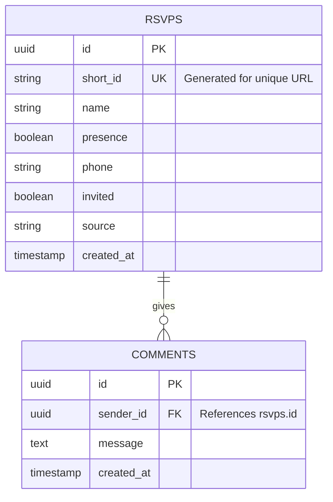

# Aden & Rahma Wedding Invitation

A digital wedding invitation application built with modern web technologies, featuring a hand-drawn aesthetic, personalized guest experiences, and interactive elements.

## 🚀 Fitur Utama

- **Personalized Invitation**: Undangan yang dipersonalisasi untuk setiap tamu menggunakan routing dinamis.
- **Splash & Hero Section**: Tampilan pembuka yang elegan dengan animasi halus.
- **Proposal Video Player**: Pemutar video kustom untuk momen lamaran dengan kontrol yang responsif.
- **Interactive Map**: Integrasi peta menggunakan MapLibre GL untuk memudahkan tamu menemukan lokasi acara.
- **RSVP System**: Form konfirmasi kehadiran tamu yang terintegrasi dengan Supabase dan dilindungi password.
- **Guestbook (Wishes)**: Tamu dapat memberikan ucapan dan doa yang ditampilkan secara real-time.
- **Digital Gift**: Informasi pengiriman hadiah digital dengan kartu bank interaktif yang dapat digeser (draggable).
- **Music Player**: Latar musik dengan kontrol play/pause dan transisi volume yang halus (fade-in/fade-out).
- **Responsive Design**: Tampilan yang optimal di berbagai perangkat, terutama mobile-first.

## 🛠️ Tech Stack

- **Framework**: [Next.js 16 (App Router)](https://nextjs.org/)
- **Language**: [TypeScript](https://www.typescriptlang.org/)
- **Styling**: [Tailwind CSS](https://tailwindcss.com/)
- **Animation**: [Motion (Framer Motion)](https://www.framer.com/motion/) & [tw-animate-css](https://github.com/v-morozov/tw-animate-css)
- **UI Components**: [Shadcn/UI](https://ui.shadcn.com/), [Radix UI](https://www.radix-ui.com/), [Vaul](https://github.com/emilkowalski/vaul)
- **Backend/Database**: [Supabase](https://supabase.com/)
- **Maps**: [MapLibre GL](https://maplibre.org/)
- **Icons**: [Tabler Icons](https://tabler-icons.io/) & [Lucide React](https://lucide.dev/)

## 📋 Requirement

- **Node.js**: Versi 18.x atau yang lebih baru.
- **Supabase Project**: Diperlukan untuk database ucapan (comments) dan RSVP.
- **Environment Variables**: Konfigurasi kunci API yang diperlukan.

## ⚙️ Konfigurasi

### 1. Kloning Repositori
```bash
git clone https://github.com/adenanteng/wedding.git
cd wedding
```

### 2. Instalasi Dependensi
```bash
npm install
```

### 3. Environment Variables
Buat file `.env.local` di direktori utama dan tambahkan variabel berikut:

```env
# Supabase Configuration
NEXT_PUBLIC_SUPABASE_URL=your_supabase_url
NEXT_PUBLIC_SUPABASE_ANON_KEY=your_supabase_anon_key

# Dashboard Configuration
PASSWORD_RSVP=your_secret_password_for_dashboard

# Notification/Other APIs (Optional)
EVO_API_URL=your_evo_api_url
EVO_API_KEY=your_evo_api_key
```

## 🏃 Cara Menjalankan

### Mode Pengembangan
Menjalankan aplikasi dengan Turbopack untuk performa pengembangan yang cepat:
```bash
npm run dev
```

### Build Produksi
Membuat bundle aplikasi untuk produksi:
```bash
npm run build
npm run start
```

### Linting & Formatting
```bash
npm run lint
npm run format
```

## 📊 Database Schema

Project ini menggunakan **Supabase** sebagai database. Berikut adalah visualisasi struktur tabelnya:



## 📄 Lisensi
Proyek ini dibuat untuk keperluan pribadi (Pernikahan Aden & Rahma). Kamu boleh pakai tapi nikahannya jangan mendahului kami ya.
